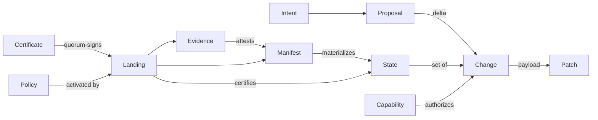

# RFC-0001: The Weft Protocol

| | |
|---|---|
| **Status** | Draft v0.3 |
| **Author** | Pranab Sarkar |
| **Created** | 2026-08-09 |
| **Revised** | 2026-08-09 — v0.2 integrated 77 findings from two independent adversarial reviews (GPT-5.6-sol, Qwen 3.8 Max); v0.3 integrates 6 further defects found by implementation testing (`prototype/`: determinism fuzzer 0/300 violations, live 3-agent swarm through a certified gate, cross-OS light-client verification). See [0001-review-log.md](0001-review-log.md) |
| **Protocol string** | `weft/0.1` |

---

## 1. Motivation

Every layer git put on top of its object store — and every layer forges put on
top of git — encodes one assumption: **human attention is the scarce resource
being managed.** Commits carry prose for human readers. Pull requests batch work
into human-reviewable chunks. Issues are unstructured English. Identity is a
config string. CI, review, and coordination live in a forge's proprietary
database, not in the repository.

Autonomous agents break the assumption. They produce hundreds of small,
independently verifiable changes per day, work concurrently at a fan-out no
human team reaches, and need machine-readable intent, provenance, and proof —
none of which the git data model can express.

**Weft** is a version-control and collaboration protocol designed for that
world. The name is the mechanism: in weaving, the *warp* is the set of
threads a loom holds under tension — the load-bearing structure — and the
*weft* is the thread shot across it, beaten into cloth one pick at a time.
Here, the certified landing log is the warp; every agent's change is weft
carried across it; the gate beats each batch into fabric. Swarms of threads,
one cloth.

Weft's design center is one workflow, deliberately narrow the way git's was:

> *N autonomous agents working the same repository concurrently, merging
> continuously, with verification — not human review — as the gate.*

Humans remain in the loop where they belong: deciding **intent** and setting
**policy**. Machines carry the evidence burden for everything else.

## 2. Design principles

1. **Content-addressed, signed, immutable objects.** Git's soul is kept. Every
   object is hashed, every object is signed, history is tamper-evident, and
   the canonical bytes *are* the object — nothing re-serializes.
2. **The actor is a keypair.** Humans, agents, and services are the same kind
   of thing: a public key with delegated, scoped, expiring, revocable
   capabilities.
3. **A change carries its why, its proof, and what it observed.** Intent,
   provenance, evidence, and read-sets are structural fields of the change
   graph, not conventions in a message body.
4. **Verification is the merge gate.** A protected ref advances when a
   quorum-certified Landing shows the policy's evidence requirements are met.
   Human approval is one evidence type among many — not a privileged ceremony.
5. **State is a set; landing is a log.** A repository state is an unordered
   set of changes, so independent work commutes and cherry-picking is free.
   Advancement of a protected ref is a hash-chained, certified, totally
   ordered log — Weft is honest that a trunk is a CP service, and makes the
   sequencer explicit instead of hiding it.
6. **Derive trust, never assert it.** Who acted for whom is computed from
   signature chains; what a build ran in is pinned by digest; what an agent
   read is recorded by hash. Free-text claims are display-only.
7. **Coordination replicates with the repo.** Intents, proposals, leases,
   evidence, policy, config, and notes are protocol objects. Cloning a repo
   clones its work graph. Self-hosting the code but renting the collaboration
   is not self-hosting.
8. **Materialization is deterministic and *verifiable*.** The same change set
   produces the same tree, byte for byte, on every node — and a signed
   materialization manifest makes tree and conflict roots checkable facts,
   not private computations.
9. **Partial everything.** Nodes replicate by filter and subscribe to events;
   non-gate nodes verify certificates instead of re-validating the world.
10. **Language-agnostic core.** The protocol understands lines, files, and
    blobs. Semantic understanding lives in evidence recipes and merge
    drivers, never in the core.
11. **Instruction provenance.** Repo text is data. Whether an agent may treat
    it as *instructions* — or a gate may *execute* it — is decided by the
    author's capability chain, converting prompt injection from an ambient
    hazard into a detectable policy violation with a provenance trail.

## 3. Terminology

- **Node** — any process speaking `weft`: a self-hosted hub (`weftd`), a CLI,
  an agent's embedded client.
- **Repo** — the set of objects sharing one Genesis; identified by the Genesis
  OID.
- **Change** — the atomic unit of modification (successor of the commit).
- **State** — an explicit set of change OIDs; the unit that is materialized
  and tested.
- **Manifest** — the signed result of materializing a State: tree root, file
  map root, conflict root.
- **Gate** — a key in a protected ref's gate set; gates certify Landings.
- **Landing** — one entry in a protected ref's certified, hash-chained
  advancement log.
- **Proposal** — a request to land a delta, submitted to a gate queue.
- **Attestation** — an Evidence object; weight comes from distinct *trust
  roots*, not distinct keys.

## 4. Encoding, addressing, signatures

- **Serialization:** deterministic CBOR (RFC 8949 §4.2.1). Canonical encoding
  is an **authoring-time obligation**: validators reject non-canonical bytes;
  relays and stores transmit and persist the original bytes verbatim and MUST
  NOT re-serialize. Unknown body fields are permitted (forward compatibility)
  precisely because nothing downstream ever re-encodes an object.
- **Hash:** BLAKE3-256.
- **Signature:** Ed25519 over
  `blake3("weft/0.1" ‖ repo ‖ type ‖ canonical_cbor(v, ts, author, auth, body))`.
  The context prefix gives domain separation against cross-protocol and
  cross-repo reuse.
- **OID:** `blake3(canonical_cbor(complete signed envelope))` — sign first,
  then hash. Every object has exactly one address, computable by any receiver.
- **Display encoding:** type prefix + bech32m-checksummed base32:
  `chg_1k5j3w…`. A miscopied character fails the checksum instead of naming a
  different object. Prefixes (`chg_`, `int_`, `evd_`, `lnd_`, …) are display
  sugar; the wire uses raw digests.

### 4.1 Object envelope

```
{
  v:      1,               // object format version
  repo:   <genesis-oid>,   // binds object to one repo (null for genesis itself)
  type:   "change" | ...,
  ts:     <unix-ms>,       // claimed time; informational, never ordering
  author: <ed25519-pubkey>,
  auth:   <capability-oid>,// authorization used; null only for genesis/identity
  body:   { ... },
  sig:    <ed25519-sig>
}
```

`repo: null` is legal only on `genesis` (whose OID *becomes* the repo ID) —
the fixed-point in v0.1's definition is resolved. `auth` names the exact
capability chain the author asserts; validators check it against the action
table (§5.3). `ts` is a claim, not a clock: Weft never uses timestamps for
ordering, and authorization validity is judged at **certification time**
(§7.3), never against `ts`.

## 5. Object types

Twenty types in five groups:

| Group | Types |
|---|---|
| Core | `genesis`, `change`, `patch`, `blob`, `chunklist`, `state`, `manifest` |
| Actors | `identity`, `capability`, `revocation`, `amendment` |
| Coordination | `intent`, `lease`, `proposal`, `note` |
| Assurance | `evidence`, `policy`, `config` |
| Consensus | `landing`, `certificate` |



### 5.1 `genesis`

Creates the repo and roots all trust. `repo: null`, `auth: null`.

```
body: {
  name:      "my-project",
  authority: [<pubkey>, ...],     // root keys, cold; quorum below
  quorum:    1,
  refs: {                          // protected refs and their gates
    "trunk": { gates: [<pubkey>, ...], threshold: 1 }
  },
  policy_init: { ...policy body, inline... },   // (bootstrap — see below)
  config_init: { ...config body, inline... }
}
```

`policy_init`/`config_init` are **inline bodies, not OIDs** (finding W3): a
policy object's envelope must bind `repo` — the Genesis OID — so Genesis
referencing a policy *object* is a cross-object hash cycle. Later landings
chain from these bodies' digests.

For a solo self-hosted operator, `gates = [own hub key]`, `threshold = 1`.
For Byzantine tolerance across organizations: `n ≥ 3f+1` gates,
`threshold ≥ 2f+1`. The consistency requirement was always there — v0.2 makes
it explicit and configurable instead of hidden and broken.

### 5.2 `identity`

Optional self-description of a key. Claims about *other* principals — the
operating human, the model vendor — are display-only unless counter-signed:

```
body: {
  kind: "human" | "agent" | "service",
  name: "refactor-worker-3",
  meta: { model: "claude-fable-5", ... },
  operator:     <pubkey>?,
  operator_sig: <sig>?      // operator key signs (this.author); verified claim
}
```

### 5.3 `capability`

A signed, scoped, expiring grant — attenuated delegation chains terminating at
a Genesis authority key.

```
body: {
  audience: <pubkey>,
  parent:   <capability-oid>?,   // absent iff author is an authority key
  scope: {
    actions: [...],              // from the action table below
    paths:   ["src/**", "!src/crypto/**"],
    refs:    ["trunk"]
  },
  exp:  <unix-ms>,
  meta: { reason: "sprint-14 refactor swarm" }
}
```

**Action table** (what `auth` must carry, per object/verb):

| Action | Grants |
|---|---|
| `publish_change` | author `change` + `patch` + `blob`/`chunklist` |
| `create_intent` / `lease_intent` | author `intent` / `lease` |
| `propose` | author `proposal` (submit to a gate queue) |
| `attest` | author `evidence` |
| `approve` | author `approval`-kind evidence |
| `note` | author `note` |
| `land` | serve as a gate: author `landing`, sign `certificate` |
| `policy` / `config` | author `policy` / `config` objects |
| `delegate` | author child `capability` (attenuation only) |
| `revoke` | author `revocation` for descendants |
| `read` | sync objects from a node (enforced at §8.2) |
| `instruct` | authored text may be labeled instructions; authored recipes may be gate-executed (§12.1) |

**Attenuation rule:** every link's audience authors the next link; every
scope is a subset of its parent's. Path containment uses a conservative,
decidable syntactic-refinement check (normative algorithm in Appendix C):
a child pattern must be derivable from a parent allow pattern by segment
refinement, and must not weaken any parent deny. Patterns that can't be
proven contained are rejected — safety over expressiveness.

**Path scope evaluation** is pinned to a moment: at certification, against
the Landing's base State (the base path of every touched file-ID, plus
resulting paths). One immutable Change, one authorization answer.

### 5.4 `revocation`

```
body: { target: <capability-oid> | <pubkey>, reason: "key compromised" }
```

Normative scope: revoking a **capability** kills it and all descendants;
revoking a **key** kills every capability whose audience is that key (and
descendants). Valid from the issuer, any ancestor issuer, or authority quorum
(via certificate). **Temporal rule:** revocation and expiry gate *future
certification only*. Objects inside an already-certified Landing remain valid
forever — history does not rot when a six-hour worker key expires (§7.3).

### 5.4a `amendment`

Authority evolution — the recovery path that v0.1 hand-waved:

```
body: { authority: [<pubkey>, ...], quorum: n, refs: {...} }   // full replacement
```

Valid only with a quorum `certificate` from the *current* authority set.
Amendments form a chain from Genesis; the newest certified amendment defines
the live authority and gate sets.

### 5.5 `intent`

The structured successor of the issue — and the unit humans actually review.

```
body: {
  ref:         "trunk",            // the ref whose landings can satisfy this
  title:       "Extract retry logic into a shared crate",
  goal:        "...precise description of desired end state...",
  constraints: ["no public API breakage", "no new dependencies"],
  criteria: [
    { desc: "all existing tests pass",        check: <recipe>? },
    { desc: "retry behavior property-tested", check: <recipe>? }
  ],
  deps:     [<intent-oid>, ...],
  priority: 0.0-1.0,
  supersedes: <intent-oid>?
}
```

A criterion with a `check` recipe is machine-verifiable; without one it needs
`approval` evidence. An intent is **satisfied** when a certified Landing on
`ref` carries a Change that `closes` it *and* the Landing's evidence covers
all criteria — closure is judged by gates at certification, not asserted by
workers.

### 5.6 `lease`

Advisory claim signaling. Renewal = a new lease superseding the old
(`prev: <lease-oid>`); expiry is passive. Leases are observable via
subscriptions (§8.3) so orchestrators can see claim collisions in real time.
Exclusion cannot be guaranteed in a distributed system and Weft does not
pretend otherwise: colliding work wastes tokens, not correctness — the gate
is downstream.

```
body: { intent: <intent-oid>, exp: <unix-ms>, prev: <lease-oid>?, note: "..." }
```

### 5.7 `change`

The successor of the commit.

```
body: {
  patch:   <patch-oid>,            // exactly one Change per Patch (§5.8)
  intent:  <intent-oid>?,
  closes:  [<intent-oid>, ...],
  footprint: ["src/retry/mod.rs", ...],   // declared touched paths; certified §7.3
  reads: [                          // observed state — what the reasoning saw
    { path: "src/api.rs", digest: <blake3> },            // whole file
    { path: "src/db.rs", lines: [<line-ID>...], digest: <blake3> },  // region
    <note-oid>, <intent-oid>
  ],
  provenance: {
    model:    "claude-fable-5"?,
    session:  <opaque-hash>?,
    prompt:   <blake3>?,
    manifest: <blob-oid>?           // execution manifest, selectively disclosable
  },
  message: "one-line summary for humans"
}
```

Two v0.2 changes matter here:

- **`reads` is the missing agent-native primitive.** Agents act on what they
  *observed*, not just what they wrote. A concurrent edit to an observed file
  invalidates the reasoning even when footprints are disjoint. Gates compare
  `reads` digests against the base State; policy chooses `stale_reads:
  reject | warn` (§5.16). Region-scoped reads exist because whole-file
  digests make append workflows self-stale (finding W6, observed live: two
  agents appending to one file spuriously invalidated each other); paths in
  the change's own footprint are excluded from its staleness check.
- **`onbehalf` is gone as a field** — the delegation path is *computed* from
  the `auth` chain's audience sequence. Forgeable free text replaced by
  derived fact (principle 6).

There is no parents field. Dependencies are intrinsic: a Change depends on the
Patches whose identities its own Patch references (§6.1).

### 5.8 `patch`

The operations payload. **Identity derives from the Patch OID** — the v0.1
hash cycle (line-IDs naming a Change whose OID depends on the Patch) is gone.
A Patch carries a `nonce` so identical content authored twice yields distinct
identities, and is bound to **exactly one Change**: gates reject a Landing
containing two Changes claiming one Patch, and the first certified claimant
wins everywhere else.

```
body: {
  nonce: <128-bit>,
  ops: [ ... ]        // in order:
}

// SELF sentinel (finding W5): an op referencing an identity created by THIS
// patch writes [null, ordinal] — a patch cannot embed its own OID. Without
// this, a single patch could never create a file and populate it.

mkfile(path)                      → file-ID (this-patch-oid, ordinal)
rmfile(fid)
move(fid, new_path)
insert(fid, after: line-ID|START, lines: [<bytes>, ...])
                                  → line-IDs (this-patch-oid, ordinal…); the
                                    lines form a chain: line k anchors line k+1
delete(fid, ids: [line-ID, ...])  → tombstones
to_blob(fid, blob|chunklist-oid)  → switches file to blob-mode; implicitly
                                    tombstones the entire live line graph
to_lines(fid, lines: [...])       → switches to line-mode with fresh identities
setattr(fid, {exec?, symlink_target?, eofnl?: bool, generated?: bool})
```

A file is exclusively **line-mode** or **blob-mode**. Cross-mode concurrent
operations (a line edit vs a `to_blob`) are a true conflict (§6.3).

**Per-operation intrinsic dependencies** (the closure rule validators apply):

| Op | Depends on |
|---|---|
| `insert` / `delete` | the patch that created each referenced line-ID, and the patch that created `fid` |
| `rmfile` / `move` / `setattr` / `to_blob` / `to_lines` | the patch that created `fid` |
| `mkfile` | nothing (same-path collisions are a materialization conflict, not a dependency) |

### 5.9 `blob` and `chunklist`

`blob` is raw bytes, content-addressed, capped at 4 MiB. Larger content uses
`chunklist`: `body: { size, chunks: [{oid, size}, ...] }` with FastCDC
chunking (target 1 MiB). Content digest = the chunklist OID; fetch semantics
are per-chunk `WANT`s, verified independently.

### 5.10 `state`

An explicit change set in **delta form** — the v0.1 full-list representation
grew quadratically and is gone:

```
body: {
  base:    <state-oid>?,           // absent = root state (empty)
  add:     [<change-oid>, ...],    // sorted; disjoint from base's closure
  summary: <blake3>                // digest of the FULL sorted closure
}
```

`summary` is the digest of the complete sorted change set, **not** a recursive
digest of the delta shape: the fuzzer proved (finding W4) that a
delta-recursive summary gives equal closures unequal summaries whenever the
split differs. Along a single landing chain it is still computable
incrementally; equality checks MUST use closure digests, never delta shape.

A State is well-formed iff dependency-closed (every intrinsic dependency of
every member present). **Only gate nodes fully validate closure** — everyone
else trusts certificates (§7.4). Merkle set-trees for O(log n) membership
proofs remain on the v0.2 roadmap; delta form already makes landing cost
proportional to the delta, not to history.

### 5.11 `manifest`

The materialization manifest — Qwen 3.8 Max's flagship contribution. It turns
"deterministic materialization" from a promise into a *checkable claim*:

```
body: {
  state:     <state-oid>,
  algorithm: "weft-rga-v1",
  tree_root:     <blake3>,   // Merkle root over (path, content-digest, attrs)
  file_map_root: <blake3>,   // Merkle root over (fid → path | tombstone)
  conflict_root: <blake3>,   // root over conflict records, each canonically
                             // encoded, SORTED BY THAT ENCODING (finding W7 —
                             // unpinned sort order lets two conforming
                             // implementations compute different roots)
  clean:     true|false
}
```

Any node that materializes a State can verify another node's manifest.
Evidence binds to a manifest (not just a state OID), so an attestation says
"I tested *these bytes*". Conflicts become policy-visible, hashable facts.

### 5.12 `evidence`

```
body: {
  manifest: <manifest-oid>,        // the bytes attested — not merely the set
  scope:    [<change-oid>, ...]?,
  recipe: {
    kind:  "test"|"lint"|"typecheck"|"property"|"eval"|"trace"|"build"|"approval",
    image: <oci-digest>,           // REQUIRED except kind=approval
    cmd:   [...],
    env:   <blake3>
  },
  results: [ { criterion: <intent-oid>#<idx>?, status: "pass"|"fail"|"error",
               metrics: {...}, log: <blob-oid>? } ],
}
```

v0.2 hard rules: an evidence object **counts toward policy only if** every
result is `pass`, the recipe digest matches one the policy names, and the
manifest matches the Landing's target. Two signed failure reports satisfy
nothing. Results and metrics are size-capped (64 KiB body); logs live in
external blobs by digest. Honesty note: pinned images bound variance, they do
not buy determinism — see §12.3 for what attestation does and does not prove.

### 5.13 `policy`

The machine-enforceable gate rules. The active policy is whatever the last
certified Landing activated (§7.3) — the v0.1 "newest in the policy ref"
construction was undefined and is gone.

```
body: {
  rules: [
    {
      match:   { refs: ["trunk"], paths: ["src/crypto/**"] },
      require: {
        evidence: [
          { recipe_digest: <blake3>, attestations: 2,
            from: [<root-pubkey>, ...], distinct_roots: 2 },
          { criterion_checks: true }        // intents' own check recipes must pass
        ],
        approvals:    { count: 1, from: [<root-pubkey>, ...] },
        intent:       true,
        stale_reads:  "reject",             // or "warn"
        order_markers: "escalate"           // §6.3; default "allow"
      }
    },
    { match: { refs: ["trunk"], paths: ["**"] },
      require: { evidence: [ { recipe_digest: <ci-recipe>, attestations: 1 } ] } }
  ]
}
```

Evidence requirements name **pinned recipe digests** and **attestor trust
roots**: `distinct_roots: 2` means attestors must chain to two *different*
listed roots — distinct keys minted by one delegating operator no longer
satisfy anything (the Sybil hole, closed). Policy is declarative data, not a
language; complex gating belongs in a check recipe.

### 5.14 `proposal`

The work-attempt lifecycle — how deltas actually reach a gate:

```
body: {
  intent:   <intent-oid>?,
  ref:      "trunk",
  base:     <landing-oid>,         // the landing this delta was built against
  delta:    [<change-oid>, ...],
  evidence: [<evidence-oid>, ...], // what the proposer already ran
  prev:     <proposal-oid>?,       // supersession chain
  status:   "open" | "withdrawn"   // terminal states (landed/failed) are derived
}
```

A proposal is `landed` when a certified Landing includes its delta, `failed`
when a gate publishes a rejection note against it, `superseded` when a newer
proposal chains `prev` to it. Orchestrators finally have protocol-level
answers to "what was attempted, on what base, and why was it abandoned?"

### 5.15 `config`

Repository operating parameters, activated via Landing exactly like policy:

```
body: {
  limits:    { blob_max: ..., evidence_body_max: 65536, ... },
  ignore:    ["target/**", "node_modules/**"],
  merge_drivers: [ { paths: ["*.lock"], driver: "theirs-latest" } ],
  retention: { evidence_days: 3650, proposals_days: 365 },
  gc_horizon_days: 90
}
```

### 5.16 `note`

The repo's memory: decisions, constraints, invariants, context.

```
body: {
  kind:    "decision" | "constraint" | "invariant" | "context",
  text:    "We fork the connection pool per-tenant because ...",
  anchors: [ { path, lines: [<line-ID>, ...]? } | <intent-oid> | <change-oid> ],
  supersedes: <note-oid>?
}
```

Anchors reference identities, so notes survive refactors. An anchor to a
tombstoned line or removed file stays *valid* — notes reference history, and
tooling renders them as historical context rather than dangling pointers.
External memory engines (e.g. YantrikDB) can index the note graph directly.

### 5.17 `landing` and `certificate`

The consensus objects — Review A's flagship contribution, and the largest
change in v0.2. See §7.

## 6. Content model

### 6.1 Identity

- File-IDs and line-IDs are `(patch-oid, ordinal)` — assigned at creation,
  immutable for life. "Editing" a line is delete + insert of a new identity.
- A file's content is an insert-after graph of line identities with
  tombstones — an RGA-family CRDT over lines.

Because patches reference identities rather than positions, a patch means the
same thing in every context where its dependencies are present. This is what
makes State-as-a-set sound, and it is the property git fundamentally lacks.

### 6.2 Normative materialization (`weft-rga-v1`)

The v0.1 sketch ("topological order, OID tiebreak") did not define a total
order. This does:

1. Build the insert graph: every line anchors on a parent (a line-ID or
   START). A multi-line `insert` forms a chain — line k is the anchor of
   line k+1 — so one op has one insertion point.
2. Emit by depth-first traversal from START. At each anchor, visit child
   inserts in **descending patch-OID order, ascending ordinal within one
   patch** (the intra-patch direction is normative — finding W1), recursing
   into each child's own subtree (its chain and children) before the next
   sibling.
3. Tombstoned lines are traversed (their subtrees emit) but not emitted.
4. Anchors that are tombstoned still position their children (§6.3).
5. Cycles cannot be constructed by conforming patches (an anchor must already
   exist in a dependency); validators reject any patch referencing an
   identity its dependency closure does not contain.

This is the standard RGA construction; convergence is a known result. The
`weft-core` library MUST ship conformance test vectors, and every
materialization is checkable against a `manifest` (§5.11).

### 6.3 Conflicts and markers

Materialization never fails; it classifies. All records below are canonical
CBOR, Merkle-rooted in `manifest.conflict_root`:

| Kind | Condition | Class |
|---|---|---|
| `order` | concurrent inserts at one anchor | **advisory marker** — deterministic OID order applies; State stays clean |
| `edit-delete` | insert anchored on a tombstoned line | conflict |
| `mode` | line ops concurrent with `to_blob`/`to_lines` | conflict |
| `edit-rm` | line/tree ops concurrent with `rmfile` of the same file | conflict (finding W2 — v0.2's table had no class for this) |
| `tree` | same path from two live file-IDs; move-move divergence | conflict — deterministic rename `path~<fid-prefix>` recorded in file map |

v0.1 treated same-anchor inserts as conflicts, which would have serialized
every hot file (two agents appending imports is not a conflict). v0.2
downgrades `order` to an advisory marker and leans on the protocol's own
thesis: deterministic bytes + evidence catch semantic breakage; policy may
escalate markers to conflicts for designated paths (append-sensitive
formats). A State is **clean** iff it has zero conflict-class records; the
default posture is that protected refs require clean targets, and policy may
relax that where evidence outranks textual cleanliness.

### 6.4 Canonical VFS byte model

Byte-for-byte determinism requires a byte model, not just an ordering:

- A line is a byte string containing no `\n`; emission joins lines with `\n`;
  the per-file `eofnl` attr controls the final newline. CRLF is content —
  Weft does not translate line endings.
- Content bytes are never normalized (no Unicode normalization of file
  *content*).
- Paths: UTF-8, NFC-normalized, `/`-separated, no empty/`.`/`..` segments, no
  NUL. Two live paths that collide case-insensitively are a `tree` conflict
  record (so case-insensitive filesystems degrade detectably, not silently).
- Directories are implicit from paths and never empty.
- A file is line-mode or blob-mode, never both; symlinks are `setattr`
  targets; the only mode bits are `exec` and `symlink`.

### 6.5 Known limitation: the formatter problem

Agent-typical bulk rewrites — formatters, codegen, lockfiles — replace most
line identities at once, which is this model's worst case: identity
continuity is lost and concurrent nearby work degrades to conflicts.
Mitigations, in order: mark generated files (`generated` attr, blob-mode;
`config.merge_drivers` can route lockfiles to a driver), keep formatting
changes in dedicated intents (swarm-schedulable at quiet points), and the
v0.2-roadmap `epoch` compaction primitive (§15). The line model is kept
because every alternative fails worse on the design-center workload:
AST models are per-language tarpits, and pure snapshots surrender
commutation entirely.

## 7. Landings: certified ref advancement

v0.1 advanced refs with signed compare-and-swap updates. Both reviewers
independently proved that broken: local CAS is not distributed CAS — two
authorized writers could split trunk permanently, roll back history, and no
node could say which policy was active. v0.2 replaces it with an explicit
consensus core, sized to the deployment: **each protected ref is a
hash-chained log of Landings, certified by a gate quorum defined in Genesis.**
For a solo hub that is one key and zero ceremony; for a federation it is a
real BFT quorum. The cost was always there — Weft now pays it where you can
see it.

### 7.1 `landing`

```
body: {
  ref:          "trunk",
  seq:          42,
  prev:         <landing-oid>,       // hash chain; null for seq 0
  base_state:   <state-oid>,
  delta:        [<change-oid>, ...], // from one or more batched proposals
  target_state: <state-oid>,
  manifest:     <manifest-oid>,      // materialization of target_state
  policy:       <policy-oid>,        // policy this landing was judged under
  policy_next:  <policy-oid>?,       // activation for subsequent landings
  config_next:  <config-oid>?,
  evidence:     [<evidence-oid>, ...],   // exactly what counted
  proposals:    [<proposal-oid>, ...],
  authorizations: [<capability-oid>, ...] // chains checked at certification
}
```

### 7.2 `certificate`

The multisignature format v0.1 declared and never defined:

```
body: {
  subject:    <landing-oid> | <amendment-oid> | <revocation-oid>,
  signatures: [ { key: <pubkey>, sig: <sig> }, ... ]   // key-sorted, distinct
}
```

A Landing is **certified** when a certificate carries `threshold` valid gate
signatures. Each gate MUST durably sign at most one Landing per
`(ref, seq, prev)` — equivocation is provable misbehavior (two conflicting
signatures from one key) and grounds for amendment. A protected ref resolves
to the target of the highest contiguously certified Landing. Non-protected
refs (scratch namespaces per agent) skip all of this — they are cheap
advisory pointers.

### 7.3 Certification checklist

Gates sign only after verifying, with all referenced objects locally present:

1. `prev` is the current certified head; `base_state = prev.target_state`.
2. `target_state = base_state ∪ dependency_closure(delta)` — **supersets
   only**; history removal is unrepresentable. Reverts are new Changes that
   tombstone content.
3. `policy` is the policy activated by the certified chain (bootstrap:
   `genesis.policy_init`); `policy_next`/`config_next` satisfy the current
   policy's own amendment rule.
4. Every Change's `auth` chain is valid **now** (unexpired, unrevoked,
   attenuation-correct, actions sufficient); path scopes evaluated against
   `base_state`. Once certified, valid forever — expiry and revocation gate
   future certification only, so history cannot rot.
5. Declared footprints match the patches' actual touched paths; mismatch
   rejects (footprints then serve light clients trustably).
6. `reads` digests match `base_state` content, per the policy's
   `stale_reads` posture.
7. Each Patch is claimed by exactly one Change across the chain.
8. `manifest` is correct (the gate re-materializes) and its conflict posture
   satisfies policy.
9. Every evidence object counted: recipe digest named by policy, all results
   `pass`, manifest matches, attestor chains reach the required distinct
   roots.
10. Intent `closes` claims: criteria covered by counted evidence on the
    intent's declared `ref`.

### 7.4 Light clients

Non-gate nodes verify certificates and gate signatures — not the world. A
path-filtered node checks that certified footprints don't intersect its
blind spots and otherwise trusts the quorum it chose when it chose the repo.
This is what makes partial replication (§8) compatible with validation:
full validation is a *gate* obligation, not a universal one.

### 7.5 The gate queue: throughput without livelock

Review A proved naive optimistic landing livelocks: with exact-state evidence
and a 20-minute suite, 50 concurrent proposals invalidate each other's
evidence faster than they can re-earn it. The gate is therefore a
**serializing merge queue**:

- Proposals accumulate; the gate batches compatible ones (disjoint
  footprints, compatible reads) into a single Landing, fixes `target_state`
  *first*, then acquires evidence once for that state.
- Proposer-supplied evidence lets the gate skip known-bad batches early;
  final evidence is always against the landed manifest.
- Batching amortizes verification across the batch; the landing *rate* is
  bounded by suite duration, not the landing *width*.
- The real fix — compositional evidence, where a certified proof survives a
  disjoint delta — is the top v0.2 roadmap item (§15); `footprint` and
  `reads` exist now so it can be added without another breaking revision.

## 8. Sync protocol

Transport: QUIC (primary), WebSocket+TLS (fallback). Frames are
length-prefixed canonical CBOR.

### 8.1 Messages

| Message | Purpose |
|---|---|
| `HELLO` | repo ID, protocol version, identity pubkey, `read`-capability proof, signed nonce |
| `HEADS` | certified landing heads + amendment chain head |
| `HAVE` / `WANT` | object negotiation (full OIDs; prefix enumeration removed as collision-ambiguous) |
| `OBJ` | verbatim object bytes |
| `SUB {filter, cursor?}` | standing subscription, resumable |
| `EVT {cursor, objects}` | push delivery |

**Closure rule:** a node applies a Landing only when its enumerated closure
(delta changes, patches per filter, manifest, evidence, certificates,
authorization chains) is present. Arrival order can no longer change any
node's conclusions.

### 8.2 Read authorization

`HELLO` must prove a capability chain carrying `read` for the requested
filter's paths. Node-level ACL — honest scope for v0.1; object-level
encryption for hostile-host confidentiality is v0.2 (§15). A public repo is
simply one whose genesis delegates `read` to the null audience.

### 8.3 Subscriptions

Per-connection monotonic cursors; `SUB` with a cursor resumes after
disconnect; delivery is at-least-once (receivers dedupe by OID — objects are
immutable, so redelivery is harmless). Filters: `{types?, paths?, intents?,
refs?}`. Leases, proposals, and landings all flow through this — an
orchestrator's whole coordination loop is one subscription.

### 8.4 GC and retention

GC roots: the certified landing log and amendment chain (never collected),
plus coordination objects within `config.gc_horizon_days`. `config.retention`
extends per-type windows for audit regimes. Nothing reachable from a
certified Landing is ever collectible — auditability is a retention floor,
not a preference.

## 9. Interfaces

**MCP is the primary agent interface, not the only interface.** The sync
protocol (§8) is the real wire API; `weftd` also exposes the identical tool
surface over plain HTTP/JSON-RPC for CI systems, editors, and non-MCP agents.
SDKs (Rust core, TS/Python bindings) follow the reference node.

| Tool | Action |
|---|---|
| `repo_status` | certified heads, active policy/config, open conflicts |
| `intent_list` / `intent_create` / `intent_lease` | work discovery and claiming |
| `workspace_open` | materialize (filtered) into a working dir + identity index |
| `change_submit` | workspace diff → patch + change (position→identity mapping) |
| `evidence_run` | execute a pinned recipe in the local sandbox, publish evidence |
| `proposal_submit` | package delta + evidence into a proposal, report unmet policy requirements |
| `note_add` / `note_query` | the memory layer |
| `subscribe` | filtered event stream (MCP notifications / SSE on HTTP) |
| `cap_delegate` | mint an attenuated capability for a spawned worker |

`workspace_open` writes a **workspace manifest** (base manifest OID +
file-ID/line-ID index) alongside the tree; `change_submit` diffs against it
to produce identity-correct operations, using documented (non-normative)
heuristics for moves and duplicate lines. Agents edit ordinary files and
never see line-IDs.

## 10. Git bridge

Adoption strategy, not a compromise — the role `git-svn` played for git.
**Ownership rule: for each ref, exactly one side is authoritative.**

- **Export mode** (Weft owns the ref; git side is a read-only mirror):
  deterministic linearization of each Landing (intrinsic-dependency
  topological order, OID tiebreak) → one commit per Change; fixed committer
  identity `agc-bridge`, committer timestamp derived from landing `seq`;
  provenance in trailers (`Weft-Change`, `Weft-Intent`, `Weft-Author-Key`,
  `Weft-Model`, `Weft-Landing`). Independent bridge nodes produce identical
  mirror SHAs.
- **Import mode** (git owns the ref during migration; Weft mirrors):
  first-parent linearization; each commit → one Change diffed against the
  previously imported state; merge side-branches arrive as the content of
  their merge commit. Provenance stamped `bridge`.
- **Honest loss table:** import flattens merge topology to first-parent;
  submodules/gitlinks are recorded as opaque attrs, not followed; signed-
  commit signatures are preserved as data, not re-verified; import line
  identities are synthetic. Identity precision starts at the import boundary
  and improves from there.

## 11. Human governance

Humans govern through objects that already gate: intents (what should
happen), policy (what proof is required), approvals (evidence only their keys
can mint), and amendments (who holds authority). The reference UI's job is to
make those four surfaces legible — intent satisfaction dashboards, evidence
drill-downs, provenance chains from any line back to a human authority key.
Review assignment, notification routing, and escalation are subscription
consumers in the reference UI, deliberately not protocol objects. A
traditional diff view exists; it is not the home page.

**Roles are capability templates, not a second permission system.** The UI
MUST NOT keep its own users/roles database — that would resurrect the
forge-database disease this protocol exists to cure. A forge-style role is
nothing but a named minting template: *Maintainer* =
`{approve, delegate, create_intent, policy}` on `**`; *Contributor* =
`{publish_change, propose}` on scoped paths; *Reader* = `{read}`. Assigning a
role mints a capability; changing one is revocation + fresh delegation with a
signed audit trail; "who can do what" is always answerable from repo objects
alone, and humans and agents are governed by the identical mechanism. The UI
renders the capability graph; it never owns it.

## 12. Security considerations

### 12.1 Instruction and execution provenance

Repository text is untrusted model input. Weft's mechanism: clients label
every retrieved object `instruction | data` from the author's capability
chain (`instruct` action, in scope for the object's path). Gates additionally
refuse to *execute* any recipe whose authoring chain lacks `instruct`.
Mixed-authorship materialized files are always data.

Stated honestly (both reviewers pressed, correctly): this is provenance, not
mind control. A model can still be steered by hostile text already in its
context; sandboxing (§12.5) bounds what steering can reach, and labeling
converts injection from an ambient hazard into a *detectable policy
violation* with a signed trail. That is the strongest claim any protocol can
truthfully make here.

### 12.2 Key compromise

Capabilities are short-lived (hours-days for workers) so expiry is the norm
and revocation the exception; both gate future certification only (§7.3), so
compromise cannot rot history — recovery is amendment + revocation +
(if needed) explicit reverting Changes, all certified, all auditable.
Equivocation by a gate key is self-evidencing (two signatures, one seq) and
grounds for amendment.

### 12.3 What attestation proves

A signature proves *who claims what*, never that a computation happened.
Weft's layers: pinned recipes make claims re-runnable with bounded variance
(not determinism — kernels, clocks, and networks exist); manifests pin the
exact bytes tested; `distinct_roots` makes collusion require compromising
separate trust domains, not minting keys. Runner attestation (TEE/hardware
roots) is roadmap (§15) — the evidence schema reserves space for it. Policy
authors calibrate roots and counts to their threat model; `1` root is fine
solo and reckless for an open federation.

### 12.4 Denial of service

Publication requires a valid capability chain — spam is never anonymous.
Normative caps: evidence bodies 64 KiB (logs external by digest), configurable
blob/object limits in `config`, per-key rate limits at nodes, lease/proposal
horizon pruning. GC per §8.4.

### 12.5 Gate sandbox minimums

Gates executing recipes MUST: run containers with no network by default
(policy may allowlist), no ambient secrets, read-only base filesystems,
resource caps, and per-run scratch isolation. A gate that violates these
converts "verification is the gate" into "remote code execution as a
service" — this section is normative for conforming gate implementations.

## 13. Non-goals

1. **Not a package registry.** Landings can be referenced by registries;
   artifacts live elsewhere.
2. **Not a CI runner.** Weft defines evidence and certification; execution is
   any node's business (`weftd` embeds a runner as a convenience, bound by
   §12.5).
3. **Not a blockchain.** No global consensus, no token. Consensus is per-ref,
   per-repo, among keys its Genesis chose. Disagreement forks the repo —
   for scratch refs that's a feature; for protected refs the quorum decides.
4. **Not an AST/semantic VCS.** Lines and blobs in the core; semantics in
   recipes and merge drivers.
5. **Not a Turing-complete policy engine.** Policy is data; complex gates are
   check recipes.
6. **Not a CRDT that resolves meaning.** Convergence is byte-level and
   honest about it; *semantic* correctness is evidence's job.
7. **Not a GitHub UI clone.** The human surface is intents, evidence,
   policy, provenance.

## 14. Sequencing

1. **RFC hardening** — v0.1 written; two-model adversarial review integrated
   (v0.2); implementation-testing feedback integrated (v0.3): the
   `prototype/` executable subset validated determinism (0/300 fuzz
   violations, cross-OS), the certified gate loop, batching, order markers,
   stale-read detection, and light-client verification — and found six spec
   defects the paper reviews missed.
2. **`weft-core`** (Rust): objects, canonical CBOR, signatures, RGA
   materialization + manifests, policy evaluation, certification checklist —
   pure library, fuzzed on the determinism invariant
   (`∀ permutations of a set: identical manifest`).
3. **`weftd`**: storage, sync, gate + queue, event streams; single binary.
4. **MCP server + HTTP surface** (agents first-class before porcelain).
5. **`agc` CLI**, then the git bridge (export mode first).
6. **Dogfood**: develop agchub itself through agchub with a multi-agent
   swarm. Self-hosting is the credibility event — git's own history proves
   it.

## 15. Roadmap and open questions

Priority-ordered; groundwork for the top items is already in v0.2's schema:

1. **Compositional evidence** — certified proofs that survive
   footprint-disjoint deltas (kills the throughput ceiling of §7.5;
   `footprint` + `reads` + manifests are the substrate).
2. **Epoch compaction** — signed identity-compaction checkpoints with
   verifiable old→new maps; bounds tombstone growth and heals the formatter
   problem (§6.5).
3. **Merkle set-states** — O(log n) membership and footprint proofs for
   light clients.
4. **Object-level encryption** — E2E confidentiality on untrusted hubs
   without breaking content addressing.
5. **Runner attestation** — hardware/TEE-rooted execution proofs slotting
   into `distinct_roots`.
6. **Attestation economics** — cross-org evidence markets; the trust-root
   model was shaped so this stays possible without being promised.
7. **Naming** — resolved: the protocol is **Weft** (v0.1 called it "AGC").
   Weaving vocabulary (*pick*, *warp*, *shed*) is reserved for future
   primitives so the metaphor stays coherent as the protocol grows.

## Appendix A: One full loop, concretely

1. Pranab (authority key) publishes Intent `int_a1…` ("extract retry logic",
   ref `trunk`, two criteria, one machine-checkable) and delegates a 48-hour
   capability to orchestrator `K_orch` (`create_intent`, `delegate`,
   `propose`, paths `src/**`, ref `trunk`).
2. `K_orch` sub-delegates 6-hour, `src/retry/**`-scoped `publish_change` +
   `attest` + `propose` to worker `K_w3`; the worker publishes a Lease.
3. `K_w3`: `workspace_open` (base = landing `lnd_41`'s manifest, filter
   `src/**`) → edits files → `change_submit` → Patch `pat_e5…` + Change
   `chg_f6…` with `footprint`, `reads` digests of the API file it studied,
   and provenance (model, session, prompt hash).
4. `evidence_run` executes the criterion's pinned recipe in the local
   sandbox → Evidence over the *proposed* manifest. `proposal_submit`
   packages base=`lnd_41`, delta, evidence.
5. The trunk gate batches this proposal with a docs proposal (disjoint
   footprints), fixes `target_state`, re-materializes → manifest `man_h8…`,
   re-runs the pinned suite (policy: `distinct_roots: 1` — solo deployment),
   and requests the one required approval: Pranab's key mints `approval`
   evidence after reading the intent-satisfaction view, not a 400-line diff.
6. Gate publishes Landing `lnd_42` (prev `lnd_41`, policy, evidence list,
   proposals) + its certificate. Every subscriber's `EVT` stream delivers the
   head; light clients verify one signature and move on.
7. A sibling worker's proposal against `lnd_41` isn't invalidated — the gate
   re-bases it into the `lnd_43` batch automatically; its patch is
   identity-based, so nothing is rewritten. Stale `reads` would have flagged
   it; disjoint reads mean it lands untouched.
8. `chg_f6…` closed `int_a1…`; the intent reports **satisfied**, with a
   provenance chain from Pranab's authority key down to every line identity.

## Appendix B: Prior art and what was taken

| Project | Taken | Left |
|---|---|---|
| git | content addressing, distribution, self-hosting culture | the commit, textual merge, config-string identity |
| Pijul / Darcs | patch commutation, intrinsic dependencies | full patch-theory formalism (Weft uses RGA-style identity) |
| CRDT literature (RGA) | insert-after identity, deterministic convergence | claims of *semantic* auto-resolution |
| Radicle | keypair identity, p2p gossip forge | blockchain-adjacent naming registry |
| UCAN | attenuated capability delegation | DID/IPLD stack dependency |
| Certificate-transparency / BFT logs | hash-chained certified logs, equivocation-as-proof | global consensus ambitions |
| Unison | "names are display, identity is content" | per-language content model |
| Nix / OCI | pinned, digest-addressed execution recipes | build-system ambitions |

## Appendix C: Path-scope containment (normative sketch)

Child pattern `c` is contained in parent allow `p` iff `c` is derivable from
`p` by: replacing `**` with any concrete segment sequence or `**`-suffixed
refinement; replacing `*` with a concrete segment or narrower glob; appending
segments beneath a `**`. A child must also repeat or narrow every parent deny
that intersects it. Anything not provably contained is rejected. This is
conservative — some safe delegations are refused — and decidable in linear
time, which is the correct trade for an authorization path.

---

*Drafting: Claude Fable 5 with Pranab Sarkar. Adversarial review: GPT-5.6-sol
and Qwen 3.8 Max, whose 77 findings — and whose independent convergence on
the landing log and the materialization manifest — shaped v0.2. Full
dispositions: [0001-review-log.md](0001-review-log.md).*
